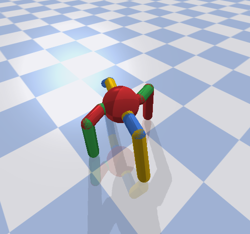

# RL-Project

## Project Overview
This project uses an ant model and attempts to train it how to walk based on RL algorithms. For this project, the main algorithms utilized are ddpg and sac. Using those algorithms, we train the ant model to learn how to walk.

## File Structure
- Common: Library that contains common functions that will be utilized throughout the project
- Ant Bot.py: Random weights used on an ant model
- bullet.py: Preset weights that work really well on the ant model
- ddpg.py: Code for the ddpg algorithm
- RL Ant.py: The full model fit with training and implementation of the algorithm
- sac.py: Code for the sac algorithm
- Tutorial.ipynb: Tutorial of the environment